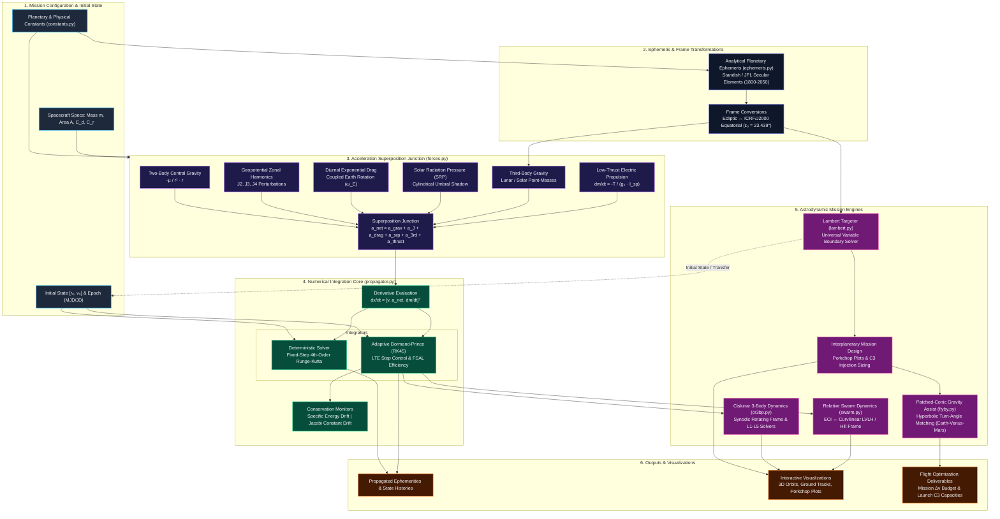

# NewtonianPropagator: Multi-Body Orbital Dynamics & Swarm Simulation Engine

[](https://github.com/mukid1805/NewtonianPropagator/actions/workflows/tests.yml)
[](https://opensource.org/licenses/MIT)


[](https://github.com/mukid1805/NewtonianPropagator/releases)
[](https://www.python.org/)
[](https://github.com/mukid1805/NewtonianPropagator/commits/main/)
[](https://mukid1805.github.io/NewtonianPropagator/)

[Quickstart Guide](QUICKSTART.md) • [References & Reading Guide](REFERENCES.md) • [Interactive Notebooks](#interactive-notebooks) • [Architecture](#repository-architecture) • [System Workflow](#system-architecture--computational-workflow)

---

A high-fidelity, modular astrodynamics simulation suite written in Python. It supports non-linear 6-DOF/7-DOF orbital mechanics, adaptive numerical integration with local truncation error control, environmental perturbation superposition, launch vehicle $C_3$ injection modeling, multi-agent relative motion (LVLH / Hill's frame), Circular Restricted Three-Body Problem (CR3BP) cislunar dynamics, and interplanetary multi-leg gravity assist trajectory optimization.

---

## Key Capabilities

* **Dual Numerical Solvers & Adaptive Step Control:**
  * **Classical RK4:** Deterministic, fixed-step 4th-order Runge-Kutta integrator.
  * **Adaptive Dormand-Prince (RK45):** Embedded 5(4) pair with adaptive step-size scaling via local truncation error (LTE) monitoring and First Same As Last (FSAL) efficiency.
  * Dynamically expands time steps across smooth interplanetary cruise (up to 5-day intervals) while autonomously refining down to sub-second resolutions during periapsis passages and flybys.
* **Launch Vehicle Injection & Mission Energetics:**
  * Empirical and analytical payload mass capacity curves as a function of characteristic energy ($C_3$).
  * Built-in launch vehicle performance profiles across multiple configurations (e.g., Falcon 9, Falcon Heavy, Atlas V, Vulcan Centaur, SLS).
  * Direct coupling between interplanetary Lambert departure energy ( $C_3$ ) and net deliverable spacecraft mass.
* **Multi-Leg Trajectories & Planetary Gravity Assists:**
  * Hyperbolic turning angle ($\delta$) and excess velocity ($\mathbf{v}_\infty$) vector matching in planetary flyby frames.
  * Automated flyby feasibility checks (periapsis altitude $h_p \ge h_{\text{safe}}$ and powered $\Delta v$ deficit computation). 
  * Patched-conic multi-leg chaining across interplanetary bodies (e.g., Earth $\to$ Venus $\to$ Mars). 
  * 3D calendar grid-search optimizer across departure, flyby, and arrival epochs for minimum - $\Delta v$ trajectory windows.
* **Interplanetary Mission Design:**
  * Universal Variable Lambert solver (Bate-Mueller-White formulation) for robust two-point boundary value targeting (elliptical, parabolic, and hyperbolic transfers).
  * Automated Porkchop Plot generation for launch window optimization scanning characteristic energy ($C_3$), arrival excess velocity ($v_\infty$), and total $\Delta v$.
  * Analytical planetary ephemerides and precision astronomical time conversions (JD, MJD, J2000 offsets).
* **Environmental Perturbation Superposition:**
  * Nonspherical Earth Geopotential Harmonics ($J_2$, $J_3$, $J_4$).
  * Atmospheric Drag with diurnal Earth rotation velocity coupling and exponential density scale height.
  * Cannonball Solar Radiation Pressure (SRP) with cylindrical Earth umbra eclipse modeling.
  * Third-Body Gravitational Perturbations (Moon direct and indirect acceleration).
* **Propulsion & Mass Depletion:**
  * Timed fixed-thrust impulsive maneuvers.
  * Continuous low-thrust electric propulsion (e.g., Hall effect thrusters) with dynamic mass flow:
    $$\dot{m} = -\frac{T}{g_0 I_{\text{sp}}}$$
* **Multi-Agent Formation Dynamics:**
  * Multi-satellite swarm propagation across identical or disparate perturbation models.
  * Real-time ECI to rotating Local-Vertical Local-Horizontal (LVLH / Hill's) frame coordinate transformations for relative motion and proximity operations.
* **Cislunar Three-Body Mechanics (CR3BP):**
  * Rotating (synodic) frame formulation for the Earth-Moon system.
  * Root-finding solvers for collinear ($L_1, L_2, L_3$) and triangular ($L_4, L_5$) equilibrium Lagrange points.
  * Free-return cislunar trajectory propagation with Jacobi Integral ($\mathcal{C}$) conservation tracking.
---
## Interactive Notebooks

The [`notebooks/`](./notebooks) directory contains hands-on mission design tutorials and trajectory simulations. Run them directly in your browser with zero local setup:

| Notebook                                 | Focus Area                                                                          |                                                                                                    Launch Runtime                                                                                                    |
|:-----------------------------------------|:------------------------------------------------------------------------------------|:--------------------------------------------------------------------------------------------------------------------------------------------------------------------------------------------------------------------:|
| **01: Interplanetary Mission Design**    | Lambert targeting, Earth-Mars porkchop plots, launcher $C_3$ matching               |   [](https://colab.research.google.com/github/mukid1805/NewtonianPropagator/blob/main/notebooks/01_interplanetary_mission_design.ipynb)    |
| **02: Gravity Assist & Flyby Mechanics** | Hyperbolic turning angles, $B$-plane scattering, post-encounter heliocentric energy | [](https://colab.research.google.com/github/mukid1805/NewtonianPropagator/blob/main/notebooks/02_gravity_assist_and_flyby_mechanics.ipynb) |
---
## Numerical Performance & Benchmark Telemetry

Empirical performance benchmarks comparing fixed-step RK4 ($\Delta t = 1800\text{ s}$ cruise / $10\text{ s}$ cislunar) against adaptive RK45 across production mission scenarios:

| Mission Scenario   | Physics Model / Trajectory                          | Fixed RK4 Steps | RK45 Adaptive Steps | Step Reduction | Runtime Speedup |        Targeting / Energy Drift        |
|:-------------------|:----------------------------------------------------|:---------------:|:-------------------:|:--------------:|:---------------:|:--------------------------------------:|
| **Scenario 6**     | Cislunar CR3BP Free-Return ($10.4\text{ d}$)        |     23,999      |         375         |   **98.4%**    |    **19.3x**    |  Jacobi drift: $8.66 \times 10^{-7}$   |
| **Scenario 7**     | Earth $\to$ Mars Lambert Arc ($310.9\text{ d}$)     |     14,923      |         81          |   **99.5%**    |    **79.4x**    |       Arrival miss: **0.00 km**        |
| **Scenario 8**     | Earth $\to$ Venus $\to$ Mars EVM ($505.0\text{ d}$) |     24,242      |         171         |   **99.3%**    |    **40.9x**    |      Intercept miss: **0.00 km**       |
| **GTO Drift Test** | 3 Orbits Highly Elliptical ($e = 0.7265$)           |        -        |         838         |       -        |        -        | Relative drift: $8.14 \times 10^{-10}$ |
---

## Mathematical Formulations

### Newtonian Acceleration Superposition Junction
The equation of motion in the Earth-Centered Inertial (ECI) frame sums all central and non-spherical forces:

$$\mathbf{a}_{\text{total}} = \mathbf{a}_{\text{grav}} + \mathbf{a}_{J2} + \mathbf{a}_{J3} + \mathbf{a}_{J4} + \mathbf{a}_{\text{lunar}} + \mathbf{a}_{\text{drag}} + \mathbf{a}_{\text{SRP}} + \mathbf{a}_{\text{thrust}}$$

* **Central Body Gravity:**

$$\mathbf{a}_{\text{grav}} = -\frac{\mu_{\text{E}}}{r^3} \mathbf{r}$$

* **Atmospheric Drag:**

$$\mathbf{a}_{\text{drag}} = -\frac{1}{2} \rho(h) \frac{C_D A_{\text{drag}}}{m} \|\mathbf{v}_{\text{rel}}\| \mathbf{v}_{\text{rel}}, \quad \mathbf{v}_{\text{rel}} = \mathbf{v} - (\vec{\omega}_{\text{E}} \times \mathbf{r})$$

* **Solar Radiation Pressure (SRP):**

$$\mathbf{a}_{\text{SRP}} = P_{\text{sun}} C_R \frac{A_{\text{SRP}}}{m} \hat{\mathbf{r}}_{\text{sun}} \quad (\text{zero in Earth umbra})$$

### Interplanetary Characteristic Energy

* **Departure Characteristic Energy ($C_3$):**

$$C_3 = v_\infty^2 = \Vert{}\mathbf{v}_{\text{dep}} - \mathbf{v}_{\text{planet}}\Vert{}^2$$


* **Hyperbolic Turning Angle ($\delta$):**

$$\sin\left(\frac{\delta}{2}\right) = \frac{1}{1 + \frac{r_p v_\infty^2}{\mu_p}}$$


---
## Repository Architecture

```text
NewtonianPropagator/
├── .github/
│   └── workflows/
│       ├── docs.yml                         # Automated MkDocs deployment to GitHub Pages
│       ├── tests.yml                        # Automated multi-OS CI test pipeline
│       └── update-citation.yml              # Automated CITATION.cff tag sync workflow
├── core/
│   ├── __init__.py                          # Package definitions and version hook
│   ├── constants.py                         # Universal physical, gravitational, and orbital constants
│   ├── cr3bp.py                             # CR3BP synodic dynamics, Lagrange solvers, frame transforms
│   ├── ephemeris.py                         # Analytical planetary ephemerides and state vectors
│   ├── flyby.py                             # Hyperbolic gravity assist mechanics and turning angle analysis
│   ├── forces.py                            # Superposition acceleration models (Gravity, J2-J4, Drag, SRP, Thrust)
│   ├── integrators.py                       # Classical RK4 & Adaptive Dormand-Prince (RK45) solvers
│   ├── lambert.py                           # Universal Variable Lambert problem solver
│   ├── launchers.py                         # Multi-agency launch vehicle catalog (ISRO, SpaceX, NASA, ULA) & C3 curves
│   ├── propagator.py                        # Unified 6-DOF / 7-DOF spacecraft propagation engine
│   ├── swarm.py                             # Multi-agent constellation and relative motion engine
│   └── time.py                              # Astronomical time conversions (JD, MJD, J2000 offsets)
├── customscripts/
│   ├── __init__.py
│   ├── template_custom_orbit.py             # Parametric sandbox for custom orbital propagation
│   └── template_interplanetary_mission.py   # Starter template for Lambert targeting & launch sizing
├── docs/
│   ├── javascripts/
│   │   └── mathjax.js                       # MathJax configuration & math typesetting integration
│   ├── stylesheets/
│   │   └── extra.css                        # Custom typography, layout overrides & sticky TOC styling
│   ├── gen_ref_nav.py                       # Automated MkDocs reference navigation generator script
│   └── index.md                             # Automated MkDocs Core API Reference landing page
├── examples/
│   ├── __init__.py
│   ├── ex01_lunar_impulsive_transfer.py     # Scenario 1: Lunar 3rd-body perturbation & impulsive burn
│   ├── ex02_drag_and_srp_decay.py           # Scenario 2: LEO orbital decay under atmospheric drag & SRP
│   ├── ex03_electric_orbit_raising.py       # Scenario 3: 30-day continuous low-thrust spiral transfer
│   ├── ex04_frozen_orbit_j3_j4.py           # Scenario 4: Higher-order zonal harmonics (J3, J4) frozen orbit
│   ├── ex05_satellite_swarm_lvlh.py         # Scenario 5: Multi-agent satellite swarm & LVLH relative motion
│   ├── ex06_cislunar_free_return.py         # Scenario 6: Cislunar free-return & Earth-Moon Lagrange points (CR3BP)
│   ├── ex07_earth_mars_transfer.py          # Scenario 7: Earth-to-Mars mission design, Porkchop plot & RK45 arc
│   └── ex08_gravity_assist_transfer.py      # Scenario 8: Automated Earth-Venus-Mars multi-leg gravity assist
├── notebooks/
│   ├── 01_interplanetary_mission_design.ipynb       # Jupyter Notebook 01: Lambert targeting & porkchop plots
│   └── 02_gravity_assist_and_flyby_mechanics.ipynb  # Jupyter Notebook 02: Hyperbolic scattering & B-plane targeting
├── tests/
│   ├── __init__.py
│   ├── test_cr3bp.py                        # Lagrange equilibrium points & Jacobi constant conservation
│   ├── test_energy_conservation.py          # Specific mechanical energy drift assertions (RK4 & RK45)
│   ├── test_ephemeris.py                    # Heliocentric state projections and SOI bounds verification
│   ├── test_flyby.py                        # Gravity assist turning angle & Delta-V validation
│   ├── test_forces.py                       # Acceleration models, harmonics, drag, SRP, and frame transforms
│   ├── test_lambert.py                      # Validation of BVP solver boundary conditions
│   ├── test_launchers.py                    # Empirical C3 curve decay & Tsiolkovsky multi-stage tests
│   ├── test_propagator.py                   # 6-DOF/7-DOF engine state transitions and burn window tests
│   ├── test_swarm.py                        # Multi-agent constellation registration and LVLH tests
│   └── test_time.py                         # Epoch and temporal conversion assertions
├── .gitattributes                           # Path overrides & Linguist language filtering
├── .gitignore                               # Comprehensive Git exclusion rules
├── CITATION.cff                             # Academic citation metadata
├── environment.yml                          # Conda environment definition
├── LICENSE                                  # MIT Open-Source License
├── main.py                                  # Interactive CLI demonstration launcher
├── mkdocs.yml                               # MkDocs configuration & Material theme settings
├── pyproject.toml                           # PEP 517/621 package configuration
├── QUICKSTART.md                            # Rapid deployment instructions
├── README.md                                # Project documentation and engineering guide
├── REFERENCES.md                            # Theoretical foundations, citations, and literature guide
└── requirements.txt                         # Pip package dependencies
```
---

## System Architecture & Computational Workflow

---
## License

This project is licensed under the MIT License - see the [LICENSE](LICENSE) file for details.

---